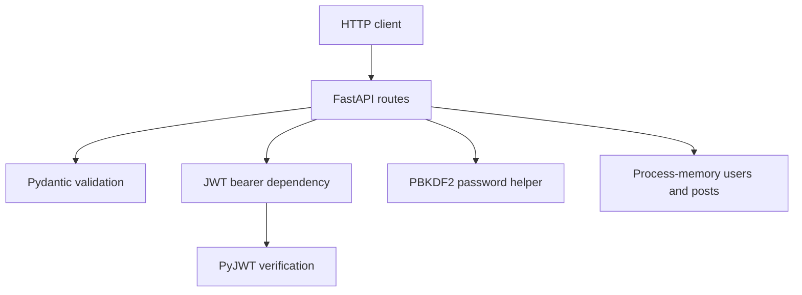

# Architecture — FastAPI JWT Mini Blog

## Scope

A single Python process hosts FastAPI routes and two in-memory collections. Public clients can read posts; signed-in clients can create posts and view a credential-free account directory. This is an authentication demonstration, not a complete CRUD system or durable multi-user platform.

## Components

| Module | Responsibility |
| --- | --- |
| `main.py` | Routing, account lookup, signup/login, post IDs and temporary collections |
| `app/model.py` | Required fields, email format and string length constraints |
| `app/auth/jwt_handler.py` | Configuration, HS256 token issue/verify, one-hour expiry |
| `app/auth/jwt_bearer.py` | Bearer-header extraction and HTTP `401` behavior |
| `app/auth/passwords.py` | Salted PBKDF2 hashing and constant-time verification |
| `tests/` | Store-isolated HTTP, validation and authentication checks |

## Data shapes

| Collection | Stored fields |
| --- | --- |
| Posts | `id`, `title`, `content` |
| Users | `fullname`, `email`, `password_hash` |

The API never returns the hash. Account listing exposes names and emails to any authenticated caller. No user owns a post in the current model; there is no owner filtering, role system or tenant partition.

Post IDs are assigned from the current maximum. This is convenient for the demo, but does not provide concurrent or distributed allocation guarantees.

## Account flow

1. Signup validates the request and rejects an existing email.
2. The server hashes the password using PBKDF2-HMAC-SHA256, 500,000 iterations and a random 16-byte salt.
3. The account enters the temporary store with a hash rather than plaintext.
4. Login searches the entire collection for the matching account and verifies its stored hash.
5. Signup/login returns an HS256 JWT in the compatibility field `access token`.

The hash format is hexadecimal salt and digest separated by a colon. It is not versioned. Changing hashing parameters requires a compatible account migration strategy once persistence is introduced.

## Token checks

JWTs contain `userID` (email) and `exp` (one-hour lifetime). Decoding uses an explicit algorithm allowlist and requires both claims. PyJWT checks expiry and signature. Invalid tokens return `None`; truthy error strings are never accepted as valid identities.

The bearer dependency requires a nonempty string identity and returns `401` with a bearer challenge for invalid/missing credentials. It validates tokens rather than account existence. There is no refresh, revocation, logout endpoint, issuer/audience policy, or persistent session store.

## Storage and reliability

Each process owns independent stores; restarts lose accounts and newly created posts. Running multiple workers produces divergent data. Duplicate checks and ID assignment are not transactional. The delivery makes these limitations explicit rather than claiming database-backed behavior.

## Verification

Tests use the real FastAPI routes with an isolated process-level store for each test. They verify signup/login including a second account, duplicate/invalid requests, post creation/read, public versus protected access, bad signatures/expiry/missing claims, safe directory output and salted hashes.

No real-browser UI, database persistence, concurrency, load or deployment checks exist. See [TESTING.md](TESTING.md).
